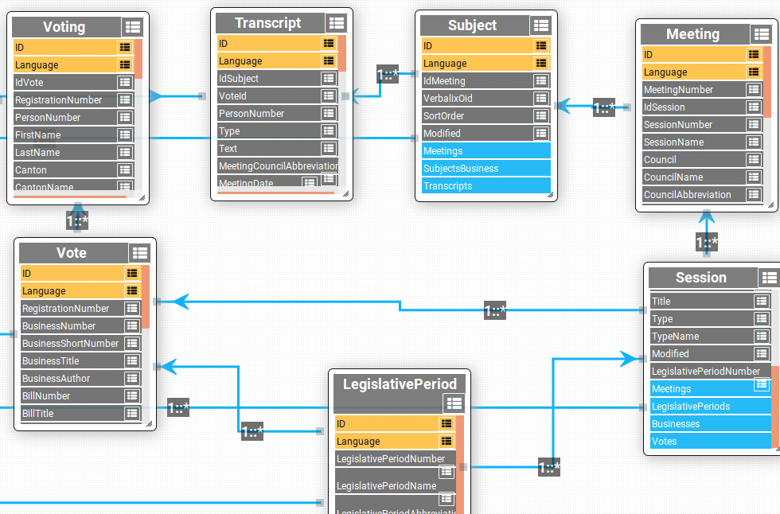

# 01 - Scraping
Here we perform the scraping of the Data we need. Note that at the current moment, we parsed a usable dataset, but it might be extended later on depending on the needs. Before describing the files themselves, let us look at the structure of the data we are parsing:

This shows what are the relations between the different data we need to parse. In order to retrieve them in an ordered way, we need to first scrap the `LegislativePeriod`, which does not depend on anything else. Then, as it points towards the `Session` field, we query the `Session` for each `LegislativePeriod` and so on, until we arrive to two of our most important fields: the `Transcript` field, which contains everything that is discussed during the sessions, and the `Voting` field, which records every vote of every deputee on every subject.

Moving on to the files of the folder, they are ordered in the following way

## 01 - Raw Scraping 
The file `01-raw_scraping.ipynb` performs the scraping from scratch of all the data we need and stores it into the `../datas/scrap` folder. It scraps all the basic fields we need, with emphasis of two especially important ones for what we will do later on : *Voting* and *Transcript*. 

## 02 - Transcript Parser
The file `02-Transcript_parser.ipynb` parses the text in the *Transcript* field into a usable string by removinf the html tags that are not needed in our case. It then overwrites the *Transcript* files with the updated version.

## 03 - Processing : Transcript to Subject
The file `03-Processing-TranscriptToSubject.ipynb` now takes the newly formatted *Transcript* files and merges all the texts relating to a single *Subject* together in one big corpus. This will be useful for the Natural Language Processing part, where we need large corpuses of text to achieve better accuracy.
